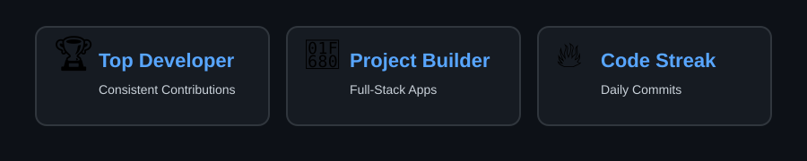

<!-- <h1 align="center">Hi 👋, I'm Zohaib Aslam</h1> -->

  

<!-- <h3 align="center">A passionate Full-stack and Software Developer from India</h3>-->

  

---

  

  

---

## 🏆 GitHub Trophies
<!-- 

  

> -->

  

---

### 🌐 Connect with me through Socials

  

  

- 👨‍💻 All projects: [GitHub](https://github.com/zobbygit)
- 📧 Email: **iamzohaib777@gmail.com**
- 📑 LinkedIn : **https://www.linkedin.com/in/zohaib-aslam-245a40253/**
---

<!-- 

  <code></code>
  <code></code>
  <code></code>
  <code></code>
  <code></code>
  <code></code>
  <code></code>
  <code></code>
  <code></code>
  <code></code>
  <code></code>
  <code></code>
  <code></code>
  <code></code>
  <code></code>
  <code></code>
  <code></code>
<code></code>
<code></code>
<code></code>
<code></code>
<code></code>
<code></code>
<code></code>
<code></code>
<code></code>
<code></code>
<code></code>
<code></code>
<code></code>
<code></code>
<code></code>
  

 -->

<h2 align="left">💻 Tech Stack &nbsp;&nbsp;</h2>

<table width="100%" border="1" cellpadding="10" cellspacing="0">
<thead>
<tr>
<th align="left">Category</th>
<th align="left">Interactive Badges / Icons</th>
<th align="left">Technologies</th>
</tr>
</thead>

<tbody>

<tr>
<td><b>Languages</b></td>
<td>

&nbsp;&nbsp;

&nbsp;&nbsp;

&nbsp;&nbsp;

&nbsp;&nbsp;

&nbsp;&nbsp;

&nbsp;&nbsp;

&nbsp;&nbsp;

</td>
<td>Java, C, C++, Python, JavaScript (ES6+), TypeScript, HTML5, CSS3</td>
</tr>

<tr>
<td><b>Frontend Development</b></td>
<td>

&nbsp;&nbsp;

&nbsp;&nbsp;

&nbsp;&nbsp;

&nbsp;&nbsp;

</td>
<td>React.js, Next.js, Vite, Tailwind CSS, Redux</td>
</tr>

<tr>
<td><b>Backend & APIs</b></td>
<td>

&nbsp;&nbsp;

&nbsp;&nbsp;

&nbsp;&nbsp;

&nbsp;&nbsp;

&nbsp;&nbsp;

</td>
<td>Node.js, Express.js, Django, FastAPI, REST APIs, HTTP</td>
</tr>

<tr>
<td><b>Databases & Backend Services</b></td>
<td>

&nbsp;&nbsp;

&nbsp;&nbsp;

&nbsp;&nbsp;

&nbsp;&nbsp;

</td>
<td>MongoDB, PostgreSQL, MySQL, Prisma, Supabase</td>
</tr>

<tr>
<td><b>Development Tools</b></td>
<td>

&nbsp;&nbsp;

&nbsp;&nbsp;

&nbsp;&nbsp;

&nbsp;&nbsp;

</td>
<td>VS Code, IntelliJ IDEA, Eclipse, Git, GitHub</td>
</tr>

<tr>
<td><b>Design & UI</b></td>
<td>

&nbsp;&nbsp;

&nbsp;&nbsp;

</td>
<td>Figma, Next UI, Lucide Icons</td>
</tr>

<tr>
<td><b>Operating Systems</b></td>
<td>

&nbsp;&nbsp;

</td>
<td>Windows, Linux</td>
</tr>

</tbody>
</table>

---

# 📊 GitHub Stats:
 
 

---

# 📊 GitHub Trophies 🏆

---

<!-- Proudly created with GPRM ( https://gprm.itsvg.in ) -->

### 🔝 Badges

---

  

---

### ✍️ Dev Quote

---

### 🐍 GitHub Contribution Grid (Snake Animation)

  <picture>
    <source media="(prefers-color-scheme: dark)" srcset="https://raw.githubusercontent.com/platane/snk/output/github-contribution-grid-snake-dark.svg" />
    <source media="(prefers-color-scheme: light)" srcset="https://raw.githubusercontent.com/platane/snk/output/github-contribution-grid-snake.svg" />
    
  </picture>

---

## GitHub Activity Graph

